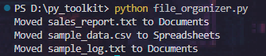
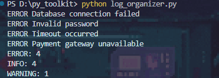
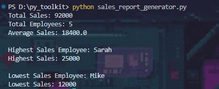

# Python Automation Toolkit

A collection of Python automation solutions designed to reduce manual work and streamline common business tasks.

## Projects

### 1. File Organizer

Automatically organizes files into appropriate folders based on file type.

Features:

* Detects file extensions
* Creates folders automatically
* Organizes documents and spreadsheets
* Reduces manual file management

### 2. Log Organizer

Processes log files and extracts operational insights.

Features:

* Counts INFO, WARNING, and ERROR events
* Identifies error messages
* Provides log summaries
* Assists with troubleshooting

### 3. Sales Report Generator

Processes CSV sales data and generates automated business reports.

Features:

* Calculates total sales
* Calculates average sales
* Identifies top-performing employees
* Identifies lowest-performing employees
* Generates formatted report files automatically

## Technologies Used

* Python
* csv
* os
* shutil

## Sample Files

* sample_data.csv
* sample_log.txt
* sales_report.txt

## Skills Demonstrated

* Business Process Automation
* Data Processing
* File Management
* Report Generation
* Python Scripting
* Problem Solving

## Author

Ansh Theodore

## Screenshots

### File Organizer

### Log Organizer

### Sales Report Generator

